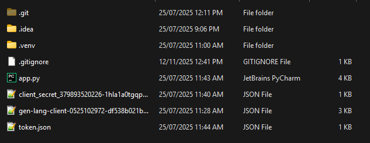

# 🚀 Drive Cloner API

A Python + Flask-based REST API that **clones entire Google Drive folders** (including all subfolders and files) using the **Google Drive API** and **Service Accounts**.

---

## ✨ Features

✅ Clone folders from a Google Drive template  
🔁 Recursively duplicates all nested files and folders  
🔐 Secure authentication using Google Service Accounts  
🔗 Returns a shareable link to the newly created folder  
⚙️ Ideal for onboarding workflows, CRMs, and automation tools  

---

## 🧠 Tech Stack

- **Python 3**
- **Flask**
- **Google Drive API**
- **Google Service Account**
- **Postman** (for API testing)

---

## 🧩 Project Structure



---

## ⚙️ Setup Instructions

1. Clone the repository  
   ```bash
   git clone https://github.com/Hassan-xl/Drive-cloner-api.git
   cd Drive-cloner-api
Create and activate a virtual environment

bash
Copy code
python -m venv venv
source venv/bin/activate   # On Mac/Linux
venv\Scripts\activate      # On Windows
Install dependencies

bash
Copy code
pip install -r requirements.txt
Run the API

bash
Copy code
python app.py
📬 Example API Request
POST /clone

json
Copy code
{
  "template_folder_id": "your_template_id_here",
  "new_name": "New Folder Name"
}
Response:

json
Copy code
{
  "new_folder_id": "1A2B3C4D5E6F",
  "share_link": "https://drive.google.com/drive/folders/1A2B3C4D5E6F"
}
🧑‍💻 Author
Hassan-xl
🔗 (https://github.com/Hassan-xl)

⭐ If you find this project useful, give it a star!
